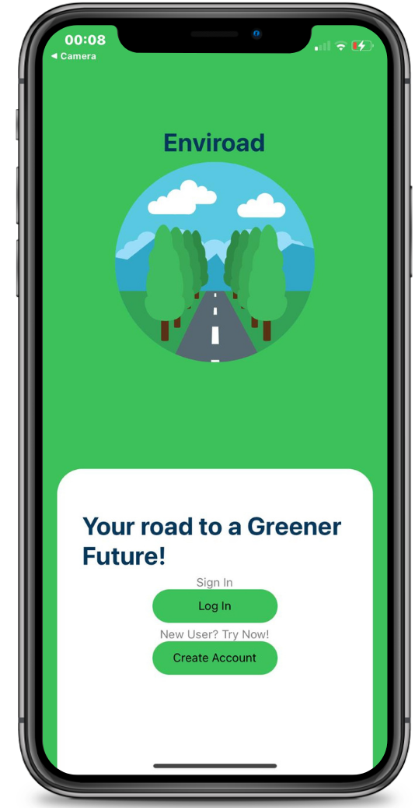

# Enviroad



Market Product:
Enviroad was developed over the duration of the ‘Mobile and Pervasive Design’ course (I527), the graduate-level course taught by Dr. Patrick Shih at Indiana University (Bloomington). The application was developed following a successive design approach which included requirement gathering, needs assessment (through interviews and surveys), intensive design, and minimum-viable implementation phases. Our research process started with the aim of empowering individuals to take small actions towards mitigating a global issue. Climate Change is the defining global and environmental issue of our time.


As a Project:
A Website with the following features:
- Register as a Member
- Login 
- Add in your Contribution to the ENvironment
- See your Journey towards Sustainability 
- Browse Different Articles

## Built With

- [ReactNative](https://reactnative.dev/ )


## Getting Started

These instructions will get you a copy of the project up and running on your local machine for development and testing purposes. See deployment for notes on how to deploy the project on a live system.

### Prerequisites

For development, you will only need Node.js installed on your environement. And please use the appropriate Editorconfig plugin for your Editor (not mandatory).
Node is really easy to install & now include NPM. You should be able to run the following command after the installation procedure below.

```
$ node --version
v0.10.24

$ npm --version
1.3.21
```

Node installation on OS X
You will need to use a Terminal. On OS X, you can find the default terminal in /Applications/Utilities/Terminal.app.

Please install Homebrew if it's not already done with the following command.
```
$ ruby -e "$(curl -fsSL https://raw.github.com/Homebrew/homebrew/go/install)"
```

If everything when fine, you should run
```
brew install node
```

Node installation on Linux

```
sudo apt-get install python-software-properties
sudo add-apt-repository ppa:chris-lea/node.js
sudo apt-get update
sudo apt-get install nodejs

```  


Node installation on Windows

Just go on official Node.js website & grab the installer. Also, be sure to have git available in your PATH, npm might need it.

Install Expo using npm install --global expo-cli
See also the Documentation of Expo (https://docs.expo.io/get-started/installation/)
### Clone

Clone this repo to your local machine using git clone https://github.iu.edu/nayshaik/IUIn.git
$ cd iuin
### Installing


```
git clone https://github.com/ishita-kumar/CliMates-App.git
$ npm install
$ cd client
$ npm install
```

### Start & watch

For running only the front end 


``` 
expo start  
```

``` 
npm start  
```


### Update sources

Some packages usages might change so you should run npm prune & npm install often. A common way to update is by doing. You might also need to add npm audit --f in some cases.


### Languages & tools

- HTML 
- Bootstrap 
- JavaScript 
- React Js framwork 
- es6ify 
- React is used for UI
- CSS


## Contribution
- [Ishita Kumar](https://github.com/ishita-kumar)
- [Rishabh Gajra](https://github.com/ishita-kumar)
- [Zaidat Ibrahim](https://github.com/ishita-kumar)
- [Ashita Soni](https://github.com/ishita-kumar)


## License

This project is licensed under the MIT License - see the [LICENSE.md](LICENSE.md) file for details

## Contribute

- Fork it! :D
- Create your feature branch: git checkout -b my-new-feature
- Commit your changes: git commi qt -am 'Add some feature'
- Push to the branch: git push origin my-new-feature
- Submit a pull request :D